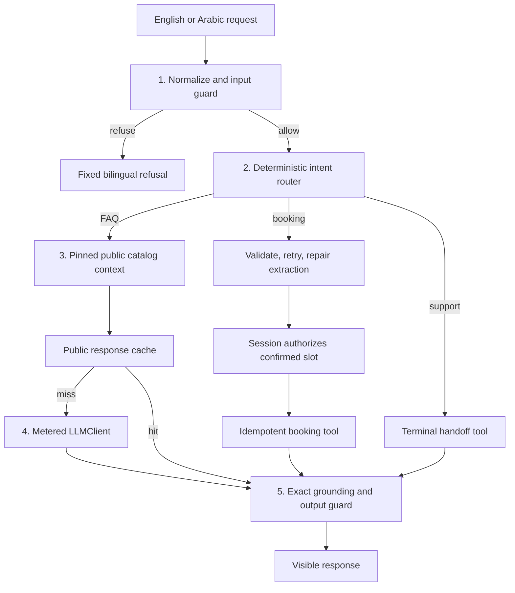

# Riwaq technical documentation

## Data flow

## Files and interfaces

`src/riwaq.py` contains the production path used by both demonstrations and evaluation. `CampusApp.respond(text, session)` is the entry point. It returns a dictionary with a `status` and `answer`; successful FAQs also include `source_id`, bookings include `booking_id` and `slot`, and handoffs include `handoff_id` and `terminal`.

`LLMClient.complete(prompt_id, payload, max_tokens)` returns `Reply`, carrying text, token usage, cached input usage, finish reason and a verification flag. `MeteredClient` wraps each attempt, records the prompt version/backend/latency, retries a 429 once and optionally falls back. HTTP access is isolated in the marked adapter section. The AST assertion checks imports outside that section. `DemoClient` is explicitly a rules simulator and marks usage unverified.

`src/evidence.py` generates the golden set and evaluates the **same** `respond` entry point. It does not supply golden answers to the client. Gold cases start from a fresh app/session to isolate state. Cache replay separately exercises a shared app. `src/live.py` uses the same harness and client boundary for optional live runs and economic measurements.

## Trust and state

User text and generated JSON are untrusted. Identity and confirmation must arrive from server-created `Session` objects. Notebook demo code constructs these objects solely to model the trusted boundary; a user-facing web app must never accept a serialized session from a browser as authorization.

The strict request object admits only `service`, `slot`, and `language`, with enumerated values. A tool registry checks exact argument keys and risk classes. Maximum tool iteration is three; the fixed workflow invokes a bounded number of tools. There is no autonomous unbounded agent. Handoff stops the route immediately. Bookings are stored in-memory and keyed by slot; a student replay gets the same booking ID and a different student cannot overwrite it.

Catalog contents are pinned, fictional and public. Tool results must match the catalog before entering context. Generated FAQs must exactly match the allowed language-specific source and source ID. The application does not expose grades or private student records. Canary tests inject an internal marker into responses and assert it never reaches the visible answer.

## Caches

Exact keys include query, language, serialized source, catalog version, prompt version, backend and guard version. Private/session-dependent routes are excluded, so no student identity belongs in this public-only key. Source changes naturally invalidate the key. Cache hits still pass the output guard.

The optional semantic tier uses character-sequence similarity only after topic and language agree, and only within identical source/prompt/backend keys. Its threshold is selected from a separate 12-pair calibration file with zero wrong calibration hits; eight held-out near-miss pairs test behavioral equivalence to fresh pipeline calls. This is a small domain-specific lexical method, not a claim about general embedding similarity. The benchmark records exact-only and combined tiers separately.

## Known design limits

The router is keyword-based, so ambiguous/multi-intent input may route poorly. Normalization handles common Unicode and Arabic variants, but regex guards are not a universal injection defence. Exact matching deliberately rejects otherwise valid paraphrases. Fixed catalog answers may not address all details in a question. The simulator is insufficient evidence of live model extraction or judgment quality. No persistent database, real SSO, live institution integration or concurrent booking guarantee is claimed.
